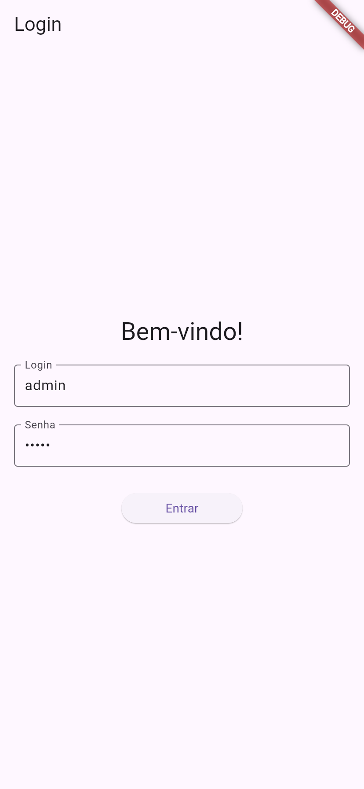
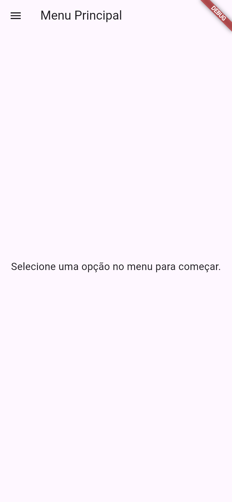
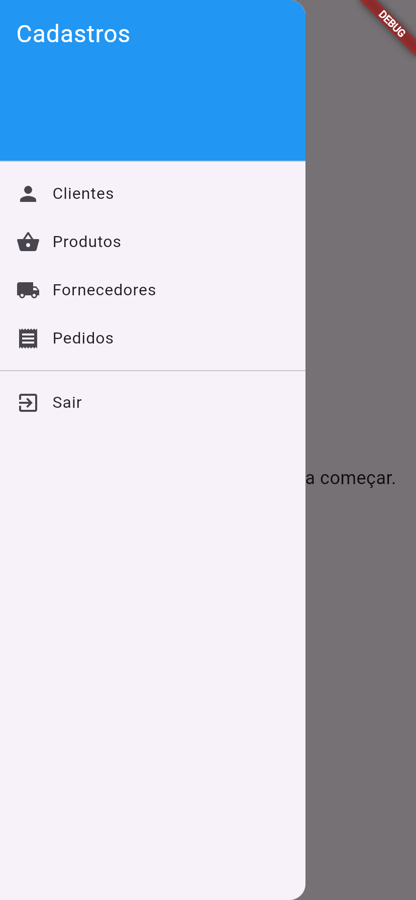
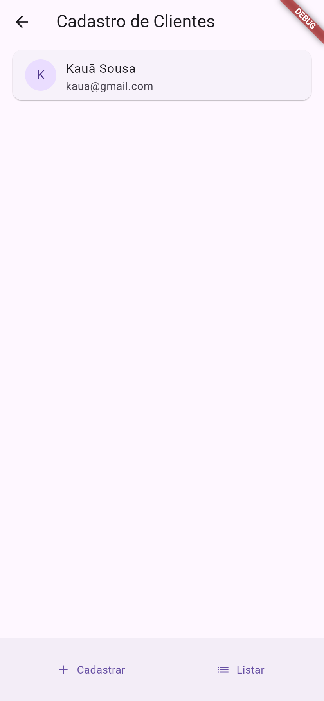
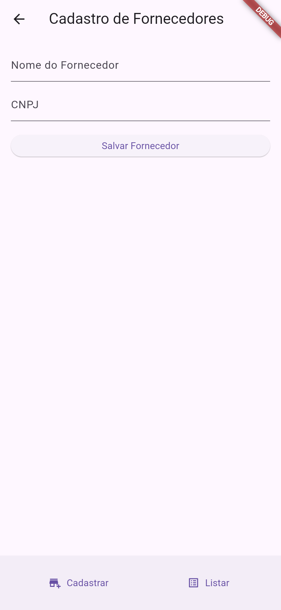
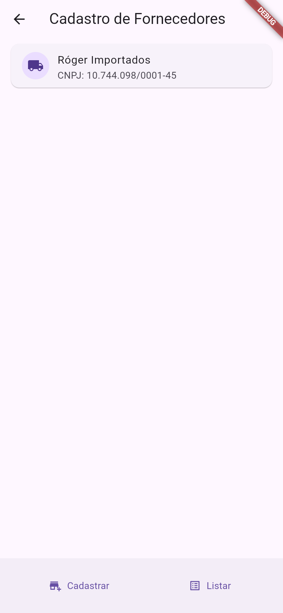
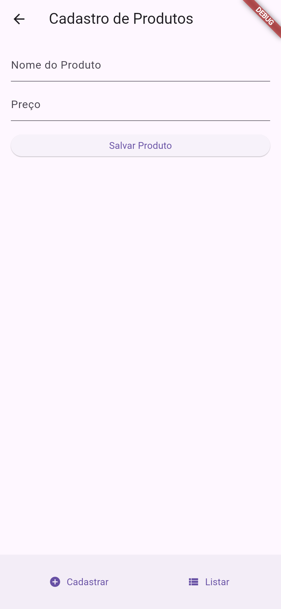
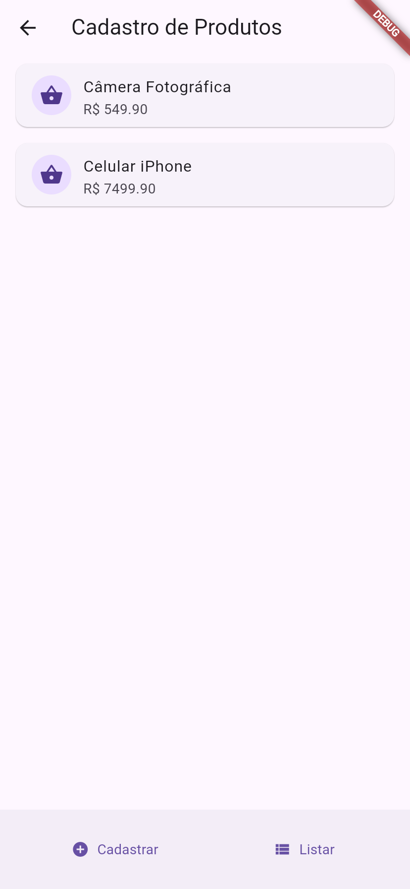
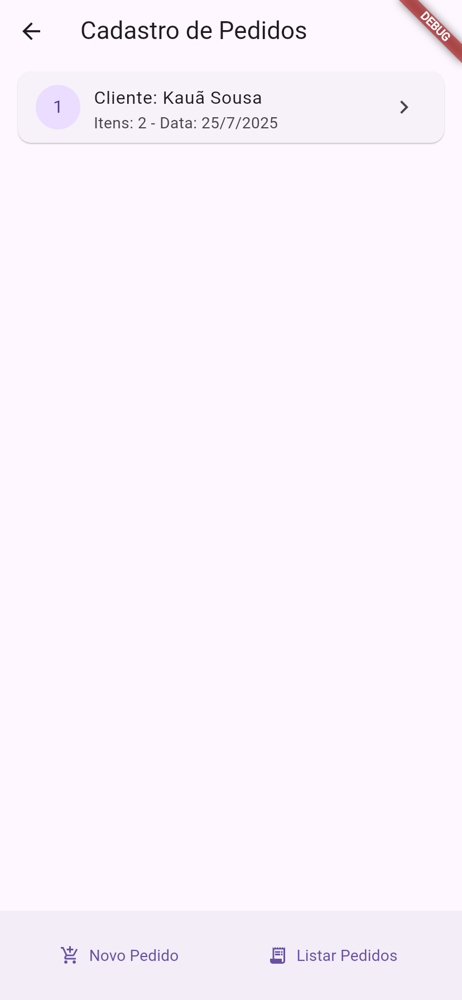

# Prova Prática Final

> Evidências aqui em baixo, também disponível na pasta **EVIDENCIAS**

## 🖼️ Telas do Aplicativo

A seguir, são apresentadas as principais telas que compõem o fluxo da aplicação.

### 1. Autenticação
A porta de entrada do sistema, onde o usuário deve fornecer suas credenciais.

*Tela de Login*

---

### 2. Tela Principal e Menu
Após o login, o usuário é direcionado para a tela principal, onde pode acessar o menu de navegação para os diferentes módulos de cadastro.

*Tela Principal*

*Menu de Navegação para Cadastros*

---

### 3. Módulo de Clientes
Funcionalidades completas para adicionar novos clientes e visualizar os que já foram cadastrados.

*Formulário de Cadastro de Clientes*

*Listagem de Clientes Cadastrados*

---

### 4. Módulo de Fornecedores
Gerenciamento de fornecedores, com telas para cadastro e listagem.

*Formulário de Cadastro de Fornecedores*

*Listagem de Fornecedores Cadastrados*

---

### 5. Módulo de Produtos
Permite ao usuário cadastrar os produtos que serão utilizados nos pedidos, incluindo nome e preço.

*Formulário de Cadastro de Produtos*

*Listagem de Produtos Cadastrados*

---

### 6. Módulo de Pedidos
O módulo mais complexo, que integra os outros cadastros, permitindo criar um pedido associado a um cliente e a uma lista de produtos.

*Formulário de Criação de Pedidos*

*Listagem de Pedidos Realizados*

*Visualização de Detalhes de um Pedido*

---
